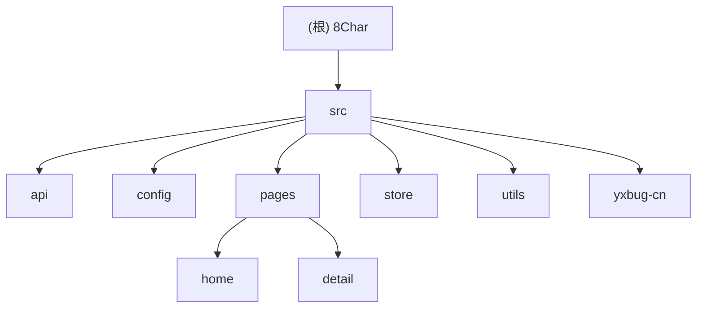

# CLAUDE.md

This file provides guidance to Claude Code (claude.ai/code) when working with code in this repository.

## 项目愿景

- `8Char` 是一个基于 Uni-App 的八字排盘应用，围绕“已知时间/四柱 -> 排盘结果 -> 细盘分析 -> 在线批命”提供完整 H5 与多平台发布能力。
- 项目主要发布到 H5，但 `package.json` 已声明 app、小程序、快应用等多平台脚本；`README.md` 明确说明其他平台未完整发布验证。
- `README.md` 同时给出重要约束：项目仅供学习研究；若部署到其他服务器，需要保留 LOGO、版权、赞助、友链等项目信息；README 明确标注禁止商用。

## 架构总览

### 技术栈

- Uni-App + Vue 3 + Vite（`@dcloudio/vite-plugin-uni`）
- Pinia 状态管理
- `vk-uview-ui` 组件库
- `lunar-javascript` 负责农历、四柱、大运/流年等本地计算
- `dotenv` + `.env.*` 管理 API 主机与静态资源基址

### 启动与数据链路

1. `src/main.js` 创建 SSR App，注册 Pinia 与 `vk-uview-ui`。
2. `src/App.vue` 在 `onLaunch` 调用 `init()`，触发版本检查与 tips 预热；若访问不存在页面，统一跳回首页。
3. 首页路由定义在 `src/pages.json` 的 `pages/home/home`，核心录入逻辑位于 `src/pages/home/components/index/sheet/sheet.vue`：支持姓名、性别、排盘模式、时间选择，以及“四柱反查时间”。
4. 首页提交时依次调用 `GetInfo()` 与 `GetBook()`，将结果写入 `detail` / `book` store；随后 `useTendStore.pull()` 使用 `lunar-javascript` 在前端推导大运、流年、流月、流日、流时。
5. 结果页 `src/pages/detail/index.vue` 使用分段标签切换“命主信息 / 基本命盘 / 专业细盘 / 在线批命”；其中在线批命通过 `GetPrediction()` 按需拉取。
6. `tips` 与 `version` 也走统一 API 封装，但都带有本地缓存或周期控制逻辑。

### 关键配置来源

| 来源                                            | 作用                                                                          |
| ----------------------------------------------- | ----------------------------------------------------------------------------- |
| `package.json`                                  | Uni 多平台开发/构建脚本、依赖版本                                             |
| `vite.config.js`                                | 加载 `.env.${NODE_ENV}`、注册 `uni()`、设置 `@` 别名、H5 dev server 端口 3000 |
| `.env.development` / `.env.production`          | `VITE_API_URL`、`VITE_APP_BASE_URL`                                           |
| `src/pages.json`                                | 页面路由与 easycom 映射；`u-*` 指向 `vk-uview-ui`，`yx-*` 指向 `src/yxbug-cn` |
| `src/manifest.json`                             | Uni 平台级配置；H5 使用 `hash` 路由模式，标题为“四柱易学-阿轩的Bug”           |
| `src/App.vue`                                   | 全局样式入口；统一引入 `vk-uview-ui/index.scss` 与 `src/style/index.scss`     |
| `src/style/index.scss` / `src/style/theme.scss` | 自定义主题色、全局字体/间距工具类、平台级滚动条与页面背景样式                 |
| `jsconfig.json`                                 | `@/*` 别名、`strict: true`、`rootDir: ./src`                                  |

## 模块结构图

## 模块索引

| 模块               | 职责                       | 入口/关键文件                                                 | 备注                                                                                                   |
| ------------------ | -------------------------- | ------------------------------------------------------------- | ------------------------------------------------------------------------------------------------------ |
| `src/api`          | 后端接口声明层             | `src/api/default.js`                                          | 统一暴露 `/8char/*` 接口                                                                               |
| `src/config`       | 应用常量与命理映射         | `src/config/index.js`、`map.js`、`offset.js`                  | 版本号、元素映射、十神/太岁关系                                                                        |
| `src/pages/home`   | 首页录入与预请求           | `src/pages/home/home.vue`、`components/index/sheet/sheet.vue` | 调用 `GetInfo` / `GetBook`，写入 store 后跳转结果页                                                    |
| `src/pages/detail` | 排盘结果展示与在线批命     | `src/pages/detail/index.vue`                                  | 四大标签页；命主信息页包含称骨展示，专业细盘表格依赖 `detailStore` + `tendStore` 动态拼列              |
| `src/store`        | Pinia 状态与本地推导       | `src/store/detail.js`、`book.js`、`tend.js`、`tips.js`        | `tend` store 依赖 `lunar-javascript` 本地计算流运                                                      |
| `src/utils`        | 请求、缓存、路由、启动辅助 | `request.js`、`launch.js`、`router.js`、`version.js`          | API host、缓存清理周期、页面跳转都在这里集中                                                           |
| `src/yxbug-cn`     | 本地通用组件               | `yx-sheet.vue`、`yx-input.vue`、`yx-pillar-picker.vue` 等     | 通过 easycom 自动注册成 `yx-*` 组件；`yx-pillar-relation` 为四柱关系弹层，`yx-coding` 为开发中占位组件 |

## 运行与开发

### 已确认命令

- 安装依赖：`yarn install`
- H5 开发：`yarn run dev:h5`
- H5 SSR 开发：`yarn run dev:h5:ssr`
- H5 构建：`yarn run build:h5`
- H5 SSR 构建：`yarn run build:h5:ssr`
- 其他已声明开发脚本：`dev:app`、`dev:custom`、`dev:mp-alipay`、`dev:mp-baidu`、`dev:mp-kuaishou`、`dev:mp-lark`、`dev:mp-qq`、`dev:mp-toutiao`、`dev:mp-weixin`、`dev:quickapp-webview`、`dev:quickapp-webview-huawei`、`dev:quickapp-webview-union`
- 其他已声明构建脚本：`build:app`、`build:custom`、`build:mp-alipay`、`build:mp-baidu`、`build:mp-kuaishou`、`build:mp-lark`、`build:mp-qq`、`build:mp-toutiao`、`build:mp-weixin`、`build:quickapp-webview`、`build:quickapp-webview-huawei`、`build:quickapp-webview-union`

### 补充说明

- `README.md` 明确说明：app 平台的运行调试仍需在 HBuilderX 中进行，CLI 侧主要用于 `build:app`。
- `vite.config.js` 默认启动浏览器并使用 3000 端口。
- 全局样式链路为 `src/App.vue` -> `src/style/index.scss` -> `src/style/theme.scss`，同时 `src/uni.scss` 负责承接 `vk-uview-ui/theme.scss`。

## 测试策略

- 未发现 `test`、`lint`、`eslint`、`vitest`、`jest`、`cypress`、`playwright` 等脚本或配置文件。
- 当前验证方式更接近手工链路验证：首页录入 -> 请求命盘/古籍 -> 结果页多标签切换 -> 在线批命请求 -> 缓存清理/版本检查。
- 高风险点包括：
  - 公历时间与四柱反查两种录入模式；
  - `detail` / `book` / `tend` store 联动是否完整；
  - `bookStore.books`、`bookStore.weigh_bone` 完全依赖后端结构，缺少空态与字段兜底；
  - 结果页命主信息区直接读取 `detailStore.embryo[0..3]`、`festival.pre/next`，字段缺失会直接渲染空文案；
  - 结果页头像资源依赖生肖到 `static/icon/zodiac/*.svg` 的映射，匹配失败只会回退默认 LOGO；
  - 五行区直接读取 `detailStore.element.include/ninclude.list` 与 `item.sacle`，字段命名漂移会直接导致展示失效；
  - 基础命盘表 `table.vue` 依赖多组嵌套对象 shape，tips 类型映射分散在白名单中，结构漂移后容易出现空列或错误弹层；
  - 合冲关系区 `relation.vue` 与 `yx-pillar-relation` 共同依赖 `tb_relation` 结构稳定；
  - `live.vue` 只有手动点击后才触发 `GetPrediction()`，失败仅 toast 提示，无重试状态持久化；
  - `tips.js` 会无校验地把缓存或接口返回值直接写入 `tips` store；
  - `tend.js` 的节气切分、日期比较与 `SkipCurrentTime()` 多层索引推进最易出错；
  - `scroll/map.js` 与 `TEND_STORE_FIELD`、`tendStore` 方法名强耦合，字段重命名会直接破坏滚动轴；
  - `scroll-list.vue` 的回滚定位依赖 `uni.$u.getRect()` 与统一项宽假设；
  - 首页底部外链和清缓存行为由 `bottom/config.js` + `bottom.vue` 组合驱动，平台分支行为不同；
  - H5 `hash` 路由与 `VITE_APP_BASE_URL` 组合；
  - `version.js` 的缓存清理周期、版本差异级别与 H5 下 `window.open(GIT_URL)` 更新提示逻辑。

## 编码规范

- Vue 页面与组件主要使用 `<script setup>` 和 Composition API。
- 页面层保持较薄：复杂业务优先下沉到 `store`、`utils` 或 `config`。
- 网络请求统一经由 `src/api/default.js` 与 `src/utils/request.js`，不要在页面里直接拼接 API host。
- 页面跳转统一复用 `src/utils/router.js`；本地缓存统一复用 `src/utils/cache.js`。
- 命理相关映射（五行、十神、太岁、流运字段）优先维护在 `src/config`，避免散落在组件内部。
- 若调整版本相关逻辑，需要同步关注 `src/config/index.js` 中的 `APP_VERSION` / `API_VERSION`，它们并不会自动从 `package.json` 派生。

## AI 使用指引

- 修改首页或结果页时，同时检查 API 返回数据、Pinia store 结构、以及 `lunar-javascript` 本地计算链是否仍能衔接。
- 修改路由或组件命名时，必须同步检查 `src/pages.json` 的页面路径与 easycom 映射。
- 调整 API host、静态资源基址、部署路径时，优先改 `.env.*` 与 `vite.config.js`，不要在组件中硬编码 URL。
- 本仓库大量依赖 `yx-*` 本地组件包装统一风格；优先复用这些组件，而不是直接复制页面级样式。
- 若涉及部署文案、底部版权、LOGO 或赞助入口，请保留 README 中声明的项目信息要求。

## 扫描覆盖率（本次初始化）

- 已扫描文件数 / 估算总文件数：`72 / 89`（约 `80.90%`）
- 已覆盖模块数 / 识别模块数：`7 / 7`（`100%`）
- 已跳过或仅做路径盘点的目录：
  - `.git/`：由忽略规则跳过
  - `node_modules/`、`dist/`、`unpackage/keystore/`：由合并后的忽略规则跳过或仓库中未纳入扫描
  - `.claude/worktrees/`：CLI 工作树中的重复仓库，避免重复计数
  - `src/static/`：以静态资源为主，仅记录路径，不深读内容
- 主要缺口：
  - 结果页核心交互主干已补到滚动轴、关系摘要、基础命盘主表，但仍缺 `major/major.vue`、`basic/basic.vue` 等装配层与 `home/bottom.vue` 的组合行为深扫
  - 未发现任何自动化测试或质量工具配置
- 推荐下一步优先补扫：
  - `src/pages/detail/components/index/major/major.vue`
  - `src/pages/detail/components/index/basic/basic.vue`
  - `src/pages/home/components/index/bottom/bottom.vue`
  - `src/utils/file.js`

## 变更记录 (Changelog)

- 2026-04-05 21:09:37：初始化根级 AI 上下文；补充架构总览、模块索引、Mermaid 结构图、运行命令、覆盖率报告，并为识别模块建立本地 `CLAUDE.md`。
- 2026-04-05 21:09:37：补扫专业细盘详情、称骨组件、四柱关系弹层与全局样式入口，修正模块说明与下一步建议。
- 2026-04-05 21:09:37：补扫古籍展示、在线批命、tips 弹层与流运计算链路，补充结果页状态流转与 store 风险点。
